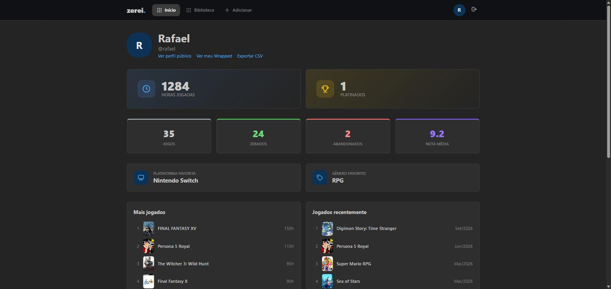
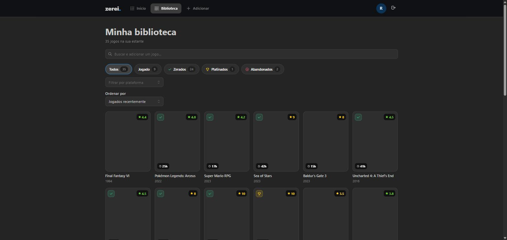
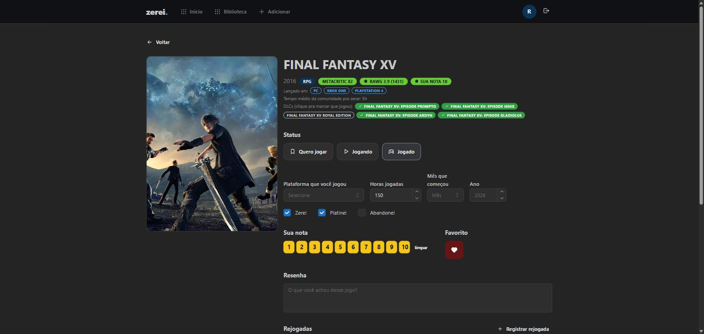

# zerei 🎮

> Sua estante de jogos. Registre tudo que já jogou — qualquer plataforma, rejogadas incluídas — e veja sua trajetória em estatísticas.

Um "Letterboxd/Goodreads pra jogos", focado em **registrar seu próprio histórico** (não é só backlog, nem só review): cada jogo pode ter várias **jogatinas** (plataforma, mês/ano, horas, status), e seu perfil junta tudo isso em estatísticas — horas jogadas, zerados, platinados, plataforma e gênero favoritos, ranking de mais jogados, e um "Wrapped" pra baixar e compartilhar.

Feito pra rodar **local**, na sua própria máquina — sem precisar publicar nada na internet.

## Prints

| Início | Biblioteca | Detalhe do jogo |
|---|---|---|
|  |  |  |

## Stack

| Camada | Tecnologia |
|---|---|
| Backend | **.NET 8** (ASP.NET Core, EF Core, JWT, BCrypt) |
| Banco de dados | **PostgreSQL** (serviço nativo — não containerizado) |
| Frontend | **React 19** (Vite, TypeScript) + **Mantine** + **TanStack Query** |
| Orquestração local | **.NET Aspire** (opcional — dashboard de telemetria) |
| Catálogo | **RAWG API** (opcional — capas, Metacritic, nota da comunidade, DLCs, jogos parecidos) |

## Como rodar

**Pré-requisitos:** [.NET 8 SDK](https://dotnet.microsoft.com/download), [Node 18+](https://nodejs.org), PostgreSQL rodando em `localhost:5432` (usuário `postgres` / senha `postgres` — ou ajuste a connection string em `backend/appsettings.json`)

```bash
git clone https://github.com/rafael-ventura/zerei.git
cd zerei
```

**1. Backend** (`backend/`):
```bash
cd backend
dotnet ef database update   # cria o banco "zerei" e aplica as migrations
dotnet run --urls http://localhost:5192
```
Na subida, o backend já roda o **seed** (gêneros/plataformas + ~50 jogos conhecidos) — idempotente, pode rodar de novo sem duplicar nada.

**2. Frontend** (`frontend-react/`, em outro terminal):
```bash
cd frontend-react
npm install
npm run dev
```
Acesse **http://localhost:5173**, crie uma conta e comece a registrar seus jogos.

**Testes:** `dotnet test` na raiz do repo.

### RAWG (opcional, mas recomendado)

Sem a chave, o app funciona só com o catálogo semeado localmente (capas aparecem como placeholders coloridos). Com ela, a busca importa qualquer jogo automaticamente — com capa, Metacritic, nota da comunidade, DLCs e até uma seção de "jogos parecidos".

1. Crie uma conta grátis em **[rawg.io/apidocs](https://rawg.io/apidocs)** e pegue sua chave (é só pra identificar quem está usando a API deles, sem custo).
2. Configure ela **localmente**, nunca direto no `appsettings.json`:
   ```bash
   cd backend
   dotnet user-secrets init
   dotnet user-secrets set "Rawg:ApiKey" "sua-chave-aqui"
   ```
3. Reinicie o backend.

## Estrutura do projeto

```
backend/
  Api/             controllers, autenticação
  Application/     services, DTOs, regras de negócio
  Domain/          entidades, enums
  Infrastructure/  DbContext, seed, cliente RAWG, migrations
backend.Tests/     testes (xUnit)
frontend-react/
  src/
    api/           hooks do TanStack Query (auth, biblioteca, catalogo, perfil)
    components/    Layout, JogoCard, StatusIcon
    pages/         login, onboarding, home, biblioteca, detalhe do jogo,
                    perfil público (/u/:username), wrapped
```

## Ideias futuras

- [ ] **Listas de jogos por usuário** — várias listas por pessoa, de 0 a N jogos cada, um jogo podendo estar em mais de uma lista; listas públicas ou privadas; compartilhar uma lista por imagem e/ou CSV pra mostrar fora do app (como o app roda local, isso puxa junto uma tarefa de privacidade de perfil/lista)
- [ ] Feed de atividade
- [ ] Linha do tempo mensal do histórico
- [ ] Conquistas reais por plataforma (Steam primeiro)
- [ ] PWA / instalável no celular

Tem uma ideia ou achou um bug? Abra uma [issue](../../issues) — é o lugar certo pra isso, mantém o README enxuto.

## Contribuindo

Veja [CONTRIBUTING.md](CONTRIBUTING.md) pro padrão de commits, testes antes de enviar, e cuidados com segredos.

Este projeto nasceu de uma vontade bem simples: ter algo que desse gosto de preencher, do jeito que eu queria usar. Está aberto pra colaboração — sinta-se à vontade pra abrir uma issue, sugerir algo ou mandar um PR.
